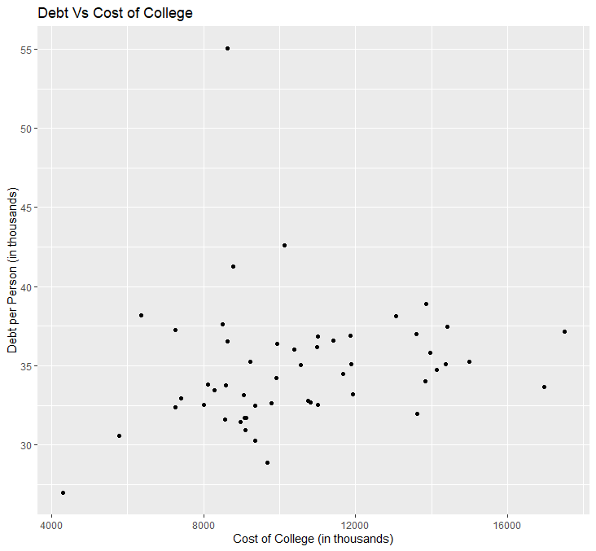

# CS 445 Data Project          
            
The focus of this report is college and the United States. One of the most normal things about college is going into debt. Our goal was to look at debt and the price of college to see if there is a correlation between how much college costs and how much debt you obtain.

## Questions:
Which state has the highest amount of student debt? Which state has the highest number of people borrowing? Which state has the highest debt per person? Is there a correlation between debt and cost of college?

## Answers:
        	
The first question we asked is which state has the highest amount of student debt? The answer to this question is California. But this question does not take into fact any other factors. If you think about this carefully the average cost of a four-year college in 2020 is $10,498.27 per year. This is including tuition and fees. As stated before, this is for a four-year college, thus your total tuition would be $41,993.08 and that is if you can manage to get your degree in four years! If your state had 10,000 students there would be close to half a billion dollars of total student debt. Thus, states with more students will have more debt. That is why our two states with the largest population also have the largest debt.

        	
To get a more accurate representation of which state is going into the greatest amount of debt is to look at debt per person. We can do this by finding the total number of borrowers in each state. Thankfully, the number of borrowers was included in the data found. This brings up the question of which state has the highest number of people borrowing money to pay for college? You guessed it! California, followed by a close second of Texas.

        	
Using these two sets of data we were able to answer a third question: Which state has the highest debt per person? The answer is Massachusetts. If you were looking at just the total debt for each state you might automatically assume that California is the most expensive state for college, but after observing this data you would know it is skewed by population. If you look closely at the graph and ignore the outliers that aren’t technically a state, you will see that the data does not have a huge spread. All the numbers are relatively close to the average debt per person by state, 34.86 thousand dollars. This means that your debt doesn’t change a ton if you choose to go to a school in a different state. You will still end up spending close to the same on student loans.  

	
The next thing we looked at was how the debt was organized. It is organized into categories of debt. These categories are less than 5k, 5k to 10k, 10k to 20k, 20k to 40k, 40k to 60k, 60k to 80k, 80k to 100k, 100k to 200k, greater than 200k. This is interesting to look at because you can see where the majority of the debt comes from. The data gathered here isn’t great to compare with other states because it is not adjusted to population. It is better to look at each state individually and see which section of debt has the most borrowers. This could change your view of which state has the most debt. For example, if the state’s largest section of borrowers was less than 5k, but the state’s total debt is higher than average, it would still be a good option. Going less than 5,000 dollars in debt to gain a bachelor’s degree is worth it.

        	
We’ve looked at the debt from each state and made some assumptions about which state has the most expensive price of college. Now the question is, which state actually has the highest cost of tuition? The answer is Vermont. Random right? Vermont has one of the lowest total debts and lowest number of borrowers. Even so, their debt per person was barely above average. But, seeing that their debt per person is close to average you would think they would have an average cost of college. That is not the case as they have the highest cost of tuition and fees. Looking at this piece of information you might conclude that there is no positive correlation between the cost of college and debt per person. But if you look at the debt per person versus the cost of college, you will notice that Vermont is way up there all by itself, making it a visual outlier. Thus, looking at the rest of the data there is a slight positive correlation between the cost of college and debt per person. This makes sense logically, and is now backed by statistical evidence. Therefore we can conclude that there is a positive correlation between the cost of college and debt per person. Don’t take our word for it, check out the data.

